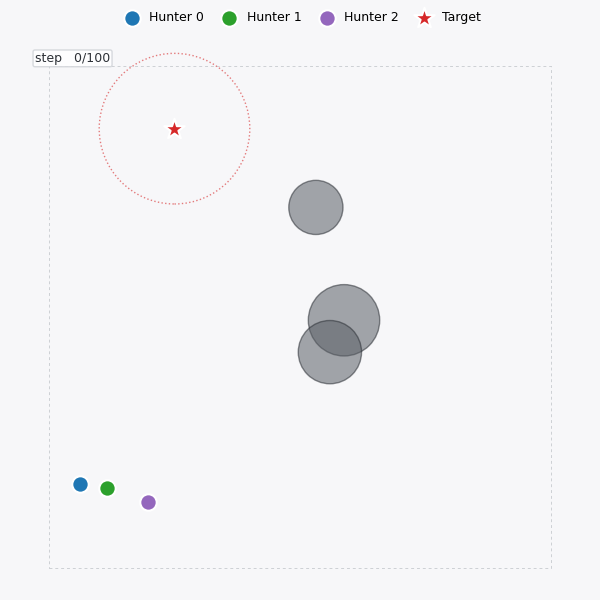
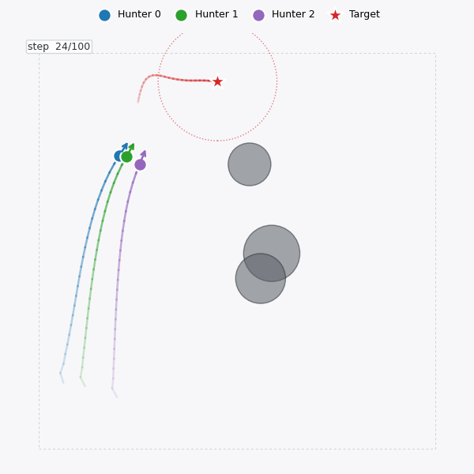
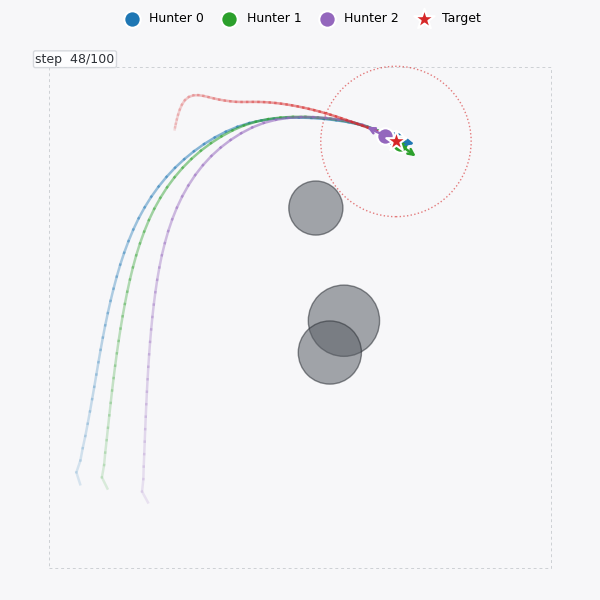

<div align="center">

# `light_mappo`

### Train cooperative multi-agent policies in one afternoon.

A minimal, readable, BYO-environment MAPPO implementation in PyTorch.
**No SMAC. No GFootball. No wandb. ~30 Python files.**

[](LICENSE)


[](README_CN.md)
[](https://www.bilibili.com/video/BV1bd4y1L73N)

<br>


<sub>3 hunters · 1 evading target · 3 obstacles · trained in 150K env steps · captured in 49 steps.</sub>

</div>

---

## What you get

```
✓ working MAPPO baseline   ✓ centralised critic / GAE / value norm / PopArt
✓ recurrent or feed-forward ✓ Box / Discrete / MultiDiscrete / MultiBinary
✓ shared- or separated-policy multi-agent training
✓ a ready-to-run UAV round-up demo with a renderer that produces this GIF
✓ ONE FILE to fill in to plug in your own environment
```

<div align="center">
<table>
  <tr>
    <td align="center" width="33%"><br><b>① Start</b><br><sub>Hunters spawn at one corner. Target idles in the capture zone.</sub></td>
    <td align="center" width="33%"><br><b>② Encircle</b><br><sub>Learned policy fans out into a coordinated pursuit formation.</sub></td>
    <td align="center" width="33%"><br><b>③ Capture</b><br><sub>Triangle around target closes. Episode ends in ~50 steps.</sub></td>
  </tr>
</table>
</div>

---

## TL;DR

```bash
# install
pip install -r requirements.txt

# train (≈3 min on a modern CPU)
python train/train.py --env_name uav --experiment_name uav_demo \
    --num_env_steps 150000 --episode_length 100 \
    --n_rollout_threads 8 --hidden_size 64 --layer_N 1

# watch what it learned
python scripts/render_uav.py \
    --model_dir results/uav/MyEnv/mappo/uav_demo/run1/models \
    --video_path videos/uav_demo.mp4 \
    --hidden_size 64 --layer_N 1 --num_episodes 3
```

Open `videos/uav_demo.mp4`. You'll see what's in the GIF above, on your own machine.

---

## Why another MAPPO repo?

The original [`marlbenchmark/on-policy`](https://github.com/marlbenchmark/on-policy) ships with five environment families (SMAC, MPE, Hanabi, GFootball, MAMuJoCo) glued throughout. Adding *your* environment means tracing imports through every runner, buffer, and config block.

`light_mappo` does the opposite. The training stack is fixed; the environment is the one variable.

|  | `on-policy` (original) | `light_mappo` |
|---|---|---|
| Python files | 200+ | ~30 |
| Bundled envs | 5 (SMAC, MPE, Hanabi, GFootball, MAMuJoCo) | 1 demo + your env |
| Plug-in env effort | rewrite scenario, registry, runner | fill in 1 file |
| External services | wandb, SC2 binary, RoboSchool | none required |
| Time to first trained policy on your env | hours | minutes |

If you want to compare against MAPPO numbers on standard benchmarks, use the original. If you want to **drop MAPPO into something new**, start here.

---

## How it works

```
        ┌──────────────────────────────────────────────┐
        │            Centralised Critic                │
        │         V( concat(o_1 … o_N) )               │
        └──────────────────────────────────────────────┘
            ▲              ▲              ▲
            │              │              │
   ┌────────┴────┐ ┌───────┴────┐ ┌──────┴─────┐
   │  Actor π_θ  │ │ Actor π_θ  │ │ Actor π_θ  │   ← parameters shared
   │   (o_1)     │ │   (o_2)    │ │   (o_3)    │      (or separated)
   └─────────────┘ └────────────┘ └────────────┘
         │              │              │
         ▼              ▼              ▼
       agent 1        agent 2        agent 3
              \         |         /
               \        ▼        /
              ┌──────────────────┐
              │   Environment    │
              └──────────────────┘
```

- **Decentralised execution**: at inference each actor sees only its own obs.
- **Centralised training**: the critic sees the joint state, so it can credit-assign properly.
- **PPO machinery** under the hood: GAE, clipped ratio, value-clip, optional Huber loss, optional PopArt / ValueNorm.

---

## Repository tour

```
light_mappo/
├── algorithms/        MAPPO trainer  +  actor-critic networks
│   ├── algorithm/      r_mappo.py  rMAPPOPolicy.py  r_actor_critic.py
│   └── utils/          act / mlp / rnn / cnn / popart / distributions
├── runner/
│   ├── shared/         single shared policy for all agents
│   └── separated/      one policy per agent
├── envs/
│   ├── env_wrappers.py  ── DummyVecEnv (shared infra)
│   │
│   ├── custom_env/      ──▶ plug your env in here
│   │   ├── env_core.py        write step / reset / spaces
│   │   ├── env_continuous.py  pre-built continuous-action wrapper
│   │   └── env_discrete.py    pre-built discrete-action wrapper
│   │
│   └── uav/             ──▶ ready-to-run demo environment
│       ├── uav_env.py         lidar-equipped 2D UAV physics
│       ├── uav_roundup_env.py framework wrapper (3 hunters)
│       └── uav_utils.py       geometry helpers
│
├── train/train.py     entry point
├── scripts/render_uav.py  load checkpoint → write MP4 / GIF
├── config.py          ~80 CLI flags  (lr, ppo_epoch, hidden_size, …)
└── utils/             SharedReplayBuffer, ValueNorm, misc
```

---

## Plugging in your environment

`envs/custom_env/env_core.py` is the only file you need to write. The spec:

```python
class EnvCore:
    def __init__(self):
        self.agent_num  = 2      # how many agents
        self.obs_dim    = 14     # per-agent observation size
        self.action_dim = 5      # per-agent action size

    def reset(self):
        # → list of length agent_num,  each element shape (obs_dim,)
        ...

    def step(self, actions):
        # actions: list of length agent_num, each shape (action_dim,)
        # ← returns [obs_list, reward_list, done_list, info_list]
        ...
```

For continuous actions, `env_continuous.py` already wraps this into the per-agent `gym.spaces.Box` lists the trainer expects. For discrete actions, swap one import in `train/train.py:_build_single_env`.

Then run training the same way as the demo, with `--env_name <whatever>`.

The UAV demo in `envs/uav/` is a worked example of a slightly more complex case: heterogeneous observation sizes, a scripted opponent agent, and matplotlib-based rendering.

---

## Algorithm features

| Component | Status |
|---|---|
| Shared & separated policies | ✓ both runners |
| Recurrent policy | ✓ GRU / naive recurrent (`--use_recurrent_policy`) |
| Action spaces | ✓ Box · Discrete · MultiDiscrete · MultiBinary |
| Advantage estimation | ✓ GAE with normalization |
| Value loss | ✓ MSE or Huber, with optional clipping |
| Value rescaling | ✓ PopArt or running ValueNorm |
| Learning rate schedule | ✓ linear decay |
| Gradient clipping | ✓ max-grad-norm |
| Parallel rollouts | ✓ DummyVecEnv |
| Logging | ✓ TensorBoard (via `tensorboardX`) |

---

## Citation

If `light_mappo` helps your work, please star the repo and cite:

```bibtex
@software{light_mappo,
  author = {Zhiqiang He},
  title  = {light\_mappo: Lightweight MAPPO implementation},
  year   = {2025},
  url    = {https://github.com/tinyzqh/light_mappo},
  note   = {Version v0.1.0}
}
```

<details>
<summary><b>Papers that have used this code</b></summary>

```bibtex
@inproceedings{he2024intelligent,
  title  = {Intelligent Decentralized Multiple Access via Multi-Agent Deep Reinforcement Learning},
  author = {He, Yuxuan and Gang, Xinyuan and Gao, Yayu},
  booktitle = {2024 IEEE Wireless Communications and Networking Conference (WCNC)},
  pages = {1--6}, year = {2024}, organization = {IEEE}
}
@article{qiu2024enhancing,
  title   = {Enhancing UAV Communications in Disasters: Integrating ESFM and MAPPO for Superior Performance},
  author  = {Qiu, Wen and Shao, Xun and Loke, Seng W and He, Zhiqiang and Alqahtani, Fayez and Masui, Hiroshi},
  journal = {Journal of Circuits, Systems and Computers},
  year = {2024}, publisher = {World Scientific}
}
@article{qiu2024optimizing,
  title   = {Optimizing Drone Energy Use for Emergency Communications in Disasters via Deep Reinforcement Learning},
  author  = {Qiu, Wen and Shao, Xun and Masui, Hiroshi and Liu, William},
  journal = {Future Internet}, volume = {16}, number = {7}, pages = {245},
  year = {2024}, publisher = {MDPI}
}
@inproceedings{yu2024path,
  title  = {Path Planning for Multi-AGV Systems Based on Globally Guided Reinforcement Learning Approach},
  author = {Yu, Lanlin and Wang, Yusheng and Sheng, Zixiang and Xu, Pengfei and He, Zhiqiang and Du, Haibo},
  booktitle = {2024 IEEE International Conference on Unmanned Systems (ICUS)},
  pages = {819--825}, year = {2024}, organization = {IEEE}
}
```

</details>

---

## Acknowledgements

- Algorithm core inspired by [`marlbenchmark/on-policy`](https://github.com/marlbenchmark/on-policy), the reference MAPPO implementation by the original authors.
- UAV environment adapted from a public MAPPO training repo; rewritten as a stand-alone benchmark env.
- English translation by [@tianyu-z](https://github.com/tianyu-z).

Maintained by [@tinyzqh](https://github.com/tinyzqh) · Released under the [MIT License](LICENSE).

<br>

<div align="center">
<sub>If <code>light_mappo</code> saved you an afternoon, leaving a ⭐ helps others find it too.</sub>
</div>
